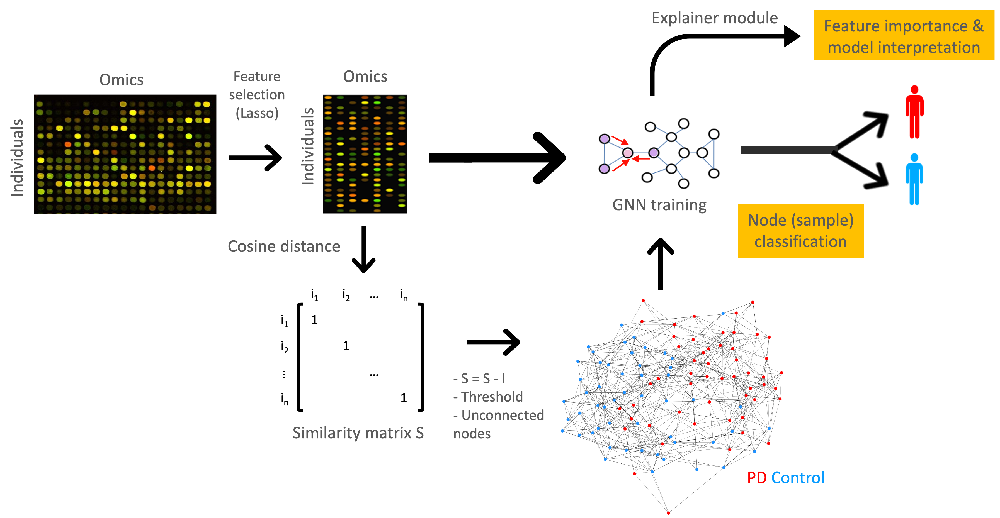
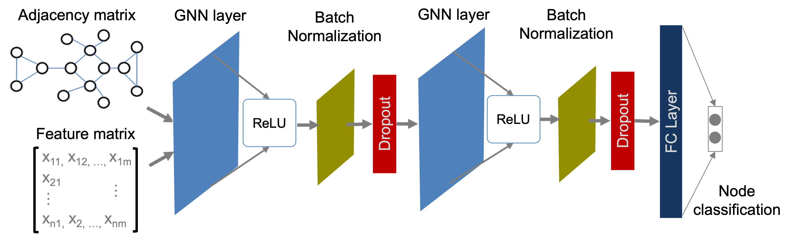

# Graph representation learning using sample-similarity networks for modelling omics data in Parkinson's disease 

<div align="center"><tr><td align="center" width="9999">

</td></tr></div>
<!-- -->

This repository contains an implementation to perform graph representation learning modelling using sample-similarity networks derived from high-throughput omics profiles, which is able to learn PD-specific fingerprints from the spatial distribution of molecular abundance similarities in an end-to-end fashion. The scripts apply the graph representation learning modelling pipeline on sample-similarity networks of transcriptomics and metabolomics data from the PPMI and the LuxPARK cohort, respectively. 

If something is not clear or you have any question, please [open an Issue](https://gitlab.lcsb.uni.lu/elisa.gomezdelope/GRL_sample_similarity_PD/-/issues).


## Repository structure
The analyses on both PPMI ans LuxPARK cohorts include some pre-processing steps prior to the modelling pipeline.

The main script to run the modelling pipeline, including network construction, model building, training, hyperparameter tunning and cross-validation, is the file executed by the wandb agent: `cv_wandb.py` (or `cv_wandb_DENOVO.py`). This file includes all the code necessary to read the hyperparameters defined from the wandb agent, build the sample-similarity network, train, and evaluate a GCN, GAT or ChebyNet model accordingly. The files it requires are in the same directory:
* `utils.py`: Many utility functions, including those for network construction, training and evaluation, feature relevance, etc. 
* `plot_utils.py`: Functions to create plots about the training and validation, as well as to project the node (sample) embeddings in 2D and 3D. They were used for debugging and experimentation.
* `wandb_config_*.yaml`: Config file for the hyperparameter search of each model.

<!-- -->
<div align="center"><tr><td align="center" width="9999">

</td></tr></div>
Other scripts used for the modelling pipeline:
* `cv_results.py`: Extracts the cross-validated results by looking at the minimum validation loss and generates figures and results tables based on node and edge importance.
* `features_plot.py`: Generates a barplot with most relevant nodes and their functional annotation.

### Data pre-processing

In the PPMI cohort:
* `ppmi_data4ML_class.R`: Performs unsupervised filters to generate data for ML modelling of snapshot data (T0) from RNAseq data.
* `ppmi_data4ML_class.R`: employs as input transcriptomics and phenotypical data resulting from previous pre-processing scripts described in repository [statistical_analyses_cross_long_PD](https://gitlab.lcsb.uni.lu/elisa.gomezdelope/statistical_analyses_cross_long_pd) for *Parsing data* and *Baseline (T0) PD/HC* (`ppmi_filter_gene_expression.R`, `ppmi_norm_gene_expression.R`, `ppmi_generate_pathway_level.R`). 

In the LuxPARK cohort:
* `lx_data4ML_class.R, lx_data4ML_class_denovo.R`: Performs unsupervised filters to generate data for ML modelling of snapshot data (T0) from metabolomics data (all PD/HC and *de novo* PD/HC).
* `lx_data4ML_class.R and lx_data4ML_class_denovo.R`: Use as input metabolomics and phenotypical data resulting from previous pre-processing scripts described in repository [statistical_analyses_cross_long_PD](https://gitlab.lcsb.uni.lu/elisa.gomezdelope/statistical_analyses_cross_long_pd) for *Parsing data* and *Baseline (T0) PD/HC* (`lx_extract_visit.R`, `lx_denovo_filter.R`). 


## Running the experiments

The code in this repository relies on [Weights & Biases](https://www.wandb.com/) (W&B) to keep track and organise the results of experiments. W&B software was responsible to conduct the hyperparameter search, and all the sweeps (needed for hyperparameter search) used are defined in the `wandb_config_*.yaml` files. All the runs and sweep definitions are publicly available at the [project's W&B page](https://wandb.ai/psn-metabolomics). Each of the sub-projects displays a different experiment (e.g., using a different model, or a different dataset).

In particular, W&B sub-projects starting with *`psn_*`* reflect the implementation of this modelling pipeline (while those starting with *`ppi_*`* or *`mmi_*`* reflect the implementation of the pipeline described in repository [GRL_molecular_interactions_PD](https://gitlab.lcsb.uni.lu/elisa.gomezdelope/grl_molecular_interactions_pd)). [reports](https://wandb.ai/tjiagom/st_extra/reportlist) to briefly organise the main results of our experiments. 

We recommend that a user wanting to run and extend our code first gets familiar with the [online documentation](https://docs.wandb.com/). As an example, one would create a sweep by running the following command in a terminal:

```bash
$ wandb sweep --project psn-LUXPARK-gcn wandb_config_gcn.yaml
``` 

Which yielded an identifier (in this case `qnpbufbx`), thus allowing us to run 130 random sweeps of our code by executing:

```bash
$ wandb agent psn-metabolomics/psn-LUXPARK-gcn_uw/qnpbufbx --count=130

```

The wandb agent will execute `cv_wandb.py` with its set of hyperparameters (as defined in `wandb_config_gcn.yaml` or corresponding `yaml` file, depending on the experiment). Note that for a given experiment, the same sweep file with random hyperparameter search is utilized.


## Data

The public transcriptomics data used in this project was derived from the Parkinson’s Progression Markers Initiative (https://www.ppmi-info.org/, RNAseq - IR3).
The metabolomics data from LuxPARK is not publicly available as it is linked to the Luxembourg Parkinson’s Study and its internal regulations. Any requests for accessing the dataset can be directed to request.ncer-pd@uni.lu.


## License
The code is available under the MIT License (see `LICENSE`).
